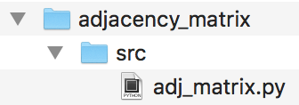
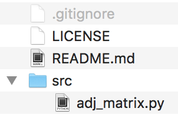
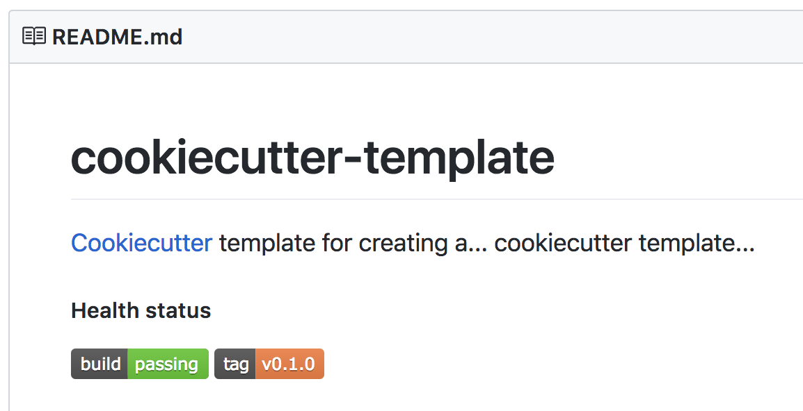
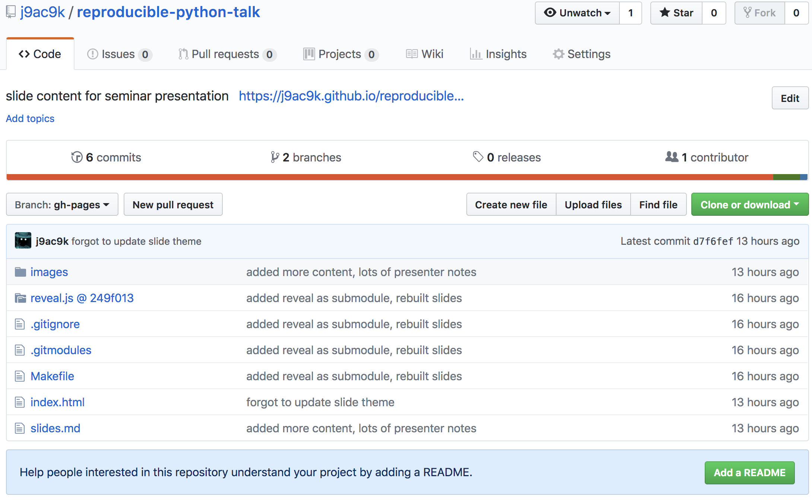
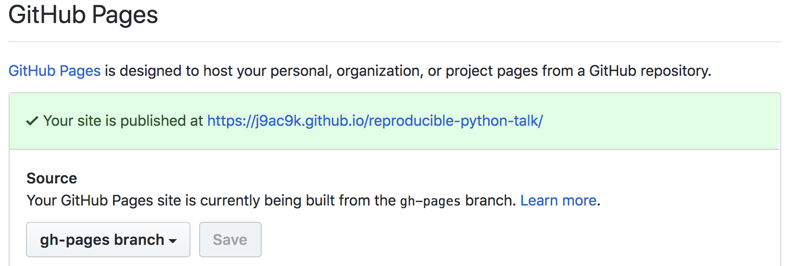

## Who Am I

@ogimoore

Graduating C.S Student

Software Engineer at BioSpeech

TimeView Developer

## Topics


## Motivation

:::incremental

* we want to share our code
* we want confidence other users can run it
* copy and paste is _not_ a valid method of sharing code

:::

## Personal Motivation

:::incremental

* Developed TimeView GUI application
* ~15 Dependencies
* Over 8,000 lines of code
* Different install process on each OS
* Install method was unsafe

:::

## Working Example

Let's say we want to make this a package

```python
from scipy import spatial

def make_adj_matrix(points):
    return spatial.distance.squareform(
      spatial.distance.pdist(points)
    )
```

## Create a Project Directory



## More Boilerplate

* find a `.gitignore` file from https://gitignore.io
* assign a license - if unsure take a look at https://choosealicence.com
* create a readme file

::: notes

assigning license is important because ...

:::



## Different Methods to Package

::: incremental

* `setuptools` with a `setup.py` to create a pip installable package
* `flit` with `pyproject.toml` to create a pip installable package
* `pipenv` with a `Pipfile` to create a reproducible python environment
* `conda-skeleton` to create a `conda` installable package

:::

<!-- ## `distutils`

::: incremental

* Part of the standard library
* Largely falling out of fashion
  * Even the official docs refer developers to other options such as ...

:::

::: notes

periodically see reference to it

::: -->

## `setuptools`

* Most common method of packaging
* Not part of the standard library, but comes with `pip` so you likely already have it
* Create `setup.py`
  * configure it to install dependencies
  * specify package metadata

::: notes

mention distutils as legacy

:::

## `setup.py`

```python
from setuptools import setup

with open("README.md", "r") as fh:
    long_description = fh.read()

setup(
    name="adj_matrix-ogi",
    version="0.0.1",  # really can be anything
    install_requires=['scipy'],
    description="Computed Adjacency Matrix From a List of Points",
    py_modules=["adj_matrix"],
    package_dir={"": "src"},
    long_description=long_description,
    long_description_content_type="text/markdown",
    classifiers=[  # informative, not actually enforced!
        "Programming Language :: Python :: 3",
        "Programming Language :: Python :: 3.6",
        "Programming Language :: Python :: 3.7",
        "License :: OSI Approved :: GNU General Public License v2 or later (GPLv2+)",
        "Operating System :: OS Independent",
    ],
    url="https://github.com/j9ac9k/adj_matrix",
    author="Ogi Moore",
    author_email="ognyan.moore@gmail.com"
    )
```

## Verify It Works

```bash
$ pip install -e .
...
$ python
Python 3.7.0 (default, Jul 26 2018, 12:04:38)
[Clang 9.1.0 (clang-902.0.39.2)] on darwin
Type "help", "copyright", "credits" or "license" for more information.
>>> from adj_matrix import make_adj_matrix
>>> make_adj_matrix([[0, 0], [1, 1], [2, 2]])
array([[0.        , 1.41421356, 2.82842712],
       [1.41421356, 0.        , 1.41421356],
       [2.82842712, 1.41421356, 0.        ]])
>>>
```

::: notes

discuss -e

:::

## Private Deployment

At this point, if the source code is on a remote git repository, it's installable via pip by someone else!

```bash
$ pip install \
git+git://github.com/j9ac9k/adj_matrix#egg=adj_matrix
...
```

::: notes

* pip supports installation from git repositories
* great for keeping content somewhat private

:::

## PyPI - Python Package Index

* main repository for python packages
* when you pip install, it grabs files from here by default
* has a handy test server

::: notes

slight break

:::

## Creating Binary Distribution

```bash
$ python setup.py bdist_wheel
...
$ ls dist/
adj_matrix_ogi-0.0.1-py3-none-any.whl
$
```

This creates a binary distribution, also known as a `wheel`, which is usually what PyPI distributes.

## Creating Source Archive

Source archives are snapshots of the current library

* `LICENSE.txt`
* supplemental data
* `setup.py`
* and more!

By default `setuptools` ignores these files.

## Source Archive Continued

::: incremental

* `pip` defaults to install wheels but falls back to source archives
* great for allowing others to audit source code
* other tools (such as conda-skeleton) use source archives

:::

## MANIFEST.in

To grab the supplemental files (README.md, LICENCE.txt, etc) you will need to manually specify them in a `MANIFEST.in` file

```bash
$ cat ~/Developer/timeview/MANIFEST.in
include timeview/manager/main.ui
include timeview/manager/dataset.db
recursive-include timeview *.json
...
```

::: notes

* files are annoying to create easy to make mistakes
* can have this file generated automatically using check-manifest python library

:::

## Verify Successful Build

```bash
$ python setup.py bdist_wheel sdist
...
$ ls dist/
adj_matrix-ogi-0.0.1.tar.gz  # source
adj_matrix_ogi-0.0.1-py3-none-any.whl  # wheel
```

::: notes

can open up the source file and verify contents if uncertain

:::

## Deploy to PyPI

* create account at PyPI
* install twine
* follow instructions from docs

```bash
$ pip install twine
...
$ twine upload dist/
...
```

::: notes

official docs are seriously good

:::

## `Flit`

::: incremental

* an alternative to `setuptools` and `twine`
* makes use of a `pyproject.toml` file
  * part of a provisional PEP 518
* `pyproject.toml` is designed to replace
  * `setup.py`
  * `MANIFEST.in`
  * `<any>.ini  # various config files`  
* able to publish to PyPI

:::

::: notes

* `pyproject.toml` appears to be where python is going but it's not there yet
* many popular libraries still do not support it (such as pytest)
* you can still use `pyproject.toml` partly, it's not all or nothing
* timeview uses it to store some settings

:::

## Enough About Packaging

## You Said There Would be Reproducibility

## `virtualenv`

* `virtualenv` is a tool that creates an isolated python environment from a reference

```bash
$ virtualenv -p /usr/bin/python2.7 my_project
$ source my_project/bin/activate
$ pip install scipy
...
```

`scipy` would be installed; but will not be accessible from outside this virtual environment

::: notes

* virtualenv does not bring its own python executable
* what if you want an older version of python?
  * for this we have pyenv, but we don't have all day here...
* conda-env environments come along with their own python executable

:::

## `pipenv`

### the new shiny thing right now

* `pipenv` is a tool that merges `virtualenv` along with `pip`
* most commands can be run as it were pip
  * `pipenv install -dev -e .`
  * `pipenv install git+git...`

::: notes

* again we see the `-e` component
* discus `-dev`
* hard to interacted with directly  `pipenv run ...`
  * if you want to do execute the python interpreter directly run `pipenv run python`

:::

## `Pipfile` & `Pipfile.lock`

`pipenv` works from two primary files

* `Pipfile`
  * list of dependencies with loose versioning requirements
* `Pipfile.lock`
  * programmatically generated
  * specifies complete dependency graph

::: notes

Discuss Difference Between Library and Application

* Disc
* Library is meant to be imported on a variety of platforms
  * not great for pipenv
* Applications is the main point of interaction
  * works better for pipenv
* your code does not need setup.py/installable

:::

## `Pipfile`

```toml
[[source]]
url = "https://pypi.org/simple"
verify_ssl = true
name = "pypi"

[packages]
scipy = ">=1.1.0"

[dev-packages]
pytest = ">=3.7.0"
```

::: notes

dev-dependencies are installed only when adding the -dev tag on pipenv install

:::

## `Pipfile + setup.py`

Suggested usage

* `Pipfile` and `Pipefile.lock` for collaborators
  * They will be forced into the same python development environment you are on
  * Good place to put dev requirements like `pytest`, `flake8`, etc
* `setup.py` for target users
  * Most end users will install via PyPI

::: notes

* `pipenv` docs go into more detail

:::

<!-- ## `poetry`

* Alternative to `pipenv`
* Not as actively developed as `pipenv`
  * But still has ongoing development
* Not as widely adopted as `pipenv`
* No personal experience -->

## Bonus Points

:::::::::::::: {.columns}
::: {.column width="50%"}

* `pytest`
* `bumpversion`
* `mypy`
* `flake8`
* `sphinx`

:::
::: {.column width="50%"}

* `pre-commit`
* `black`
* `.travis.yml`
* `appveyor.cfg`
* `contributing.md`

:::
::::::::::::::

## Now ~~Forget~~ Do Not Worry About Remembering Everything I Just Said

## Keep In Mind

::: incremental

* Doing all these manual file configurations is tedious
* We are likely to make a mistake somewhere along the way
* ~~Developers are~~ I am lazy, surely there is a way we can automate this...

:::

## 

* you give cookiecutter a template
* cookiecutter asks you a series of questions
* it creates most of the boiler plate for you

## cookiecutter-pypackage

https://github.com/audreyr/cookiecutter-pypackage

Makes the following ready to go

::: incremental

* test suite
* continuous integration
* configures `tox`
* creates simple docs via sphinx
* bumpversion
* auto PyPI release on git-tag

:::

## Other Templates

::: incremental

* templates for R projects
* templates for data science projects
* templates for latex projects
* templates for creating cookiecutter templates

:::

::: notes

use a template on a non-existent project to see how something works

:::

## You Think I'm Joking?



## Create Your Own Template

* Lots of fantastic documentation to create your own template
* Fork a similar template and make the changes

::: notes

* overkill for most people
* helpful where many projects that require similar configs (lab environment)

:::

## We'll Do It Live!

::: notes

* https://github.com/audreyr/cookiecutter-pypackage

:::

## References

* [Python Official Packaging Tutorial](https://packaging.python.org/tutorials/packaging-projects/)
* [Sheer Joy of Packaging SciPy 2018 Tutorial](https://python-packaging-tutorial.readthedocs.io/en/latest/)
* [Cookiecutter](https://github.com/audreyr/cookiecutter)
* [\@Judy2k Talk on Publishing to PyPI](https://www.youtube.com/watch?v=QgZ7qv4Cd0Y)

::: notes

* python official tutorial docs are great for your fist time through
  * they stick to a minimum working example
* scipy tutorial walks you through step by step
  * goes over making conda packages
* \@judy2k talk was presented at a recent python conference

:::

## How It's Made (Pt 1)

* slides were created from markdown

```markdown
## How It's Made (Pt 1)

* slides were created from markdown
```

## How It's Made (Pt 2)

Used `pandoc` to convert to reveal.js slides

```bash
$ pandoc slides.md -t revealjs \
                   -s \
                   -o index.html \
                   -V revealjs-url=./reveal.js \
                   -V theme=beige \
                   -V slideNumber=true
```

::: notes

had to download reveal.js and store locally
used git submodule

:::

## How It's Made (Pt 3)

Added files to github in `gh_pages` branch



## How It's Made (Pt 4)

* Enabling github pages



## Questions?

https://j9ac9k.github.io/reproducible-python-talk